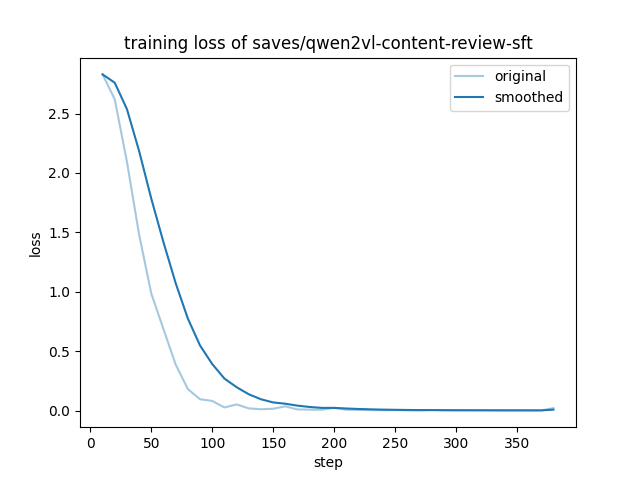

# 🔍 小红书内容审核助手

基于 **Qwen2-VL-2B + LoRA SFT** 微调的多模态内容审核系统

[](https://www.python.org/)
[](https://pytorch.org/)
[](LICENSE)

## 📋 项目简介

本项目是一个面向小红书平台的智能内容审核系统，能够自动判断用户发布的图文内容是否符合平台规范。

**核心功能：**
- 🔍 自动识别虚假宣传、夸大功效
- 🚫 检测站外引流（微信、QQ等私域）
- ⚕️ 识别违规医疗健康声明
- 📊 输出结构化审核结果和详细理由

**审核结果分类：**
| 结果 | 说明 | 示例 |
|-----|------|------|
| ✅ 通过 | 内容符合规范 | 日常分享、真实体验 |
| ✏️ 需要修改 | 轻微问题，修改后可发布 | 诱导互动、模糊表述 |
| ❌ 违规删除 | 严重违规，直接删除 | 虚假宣传、私域引流 |
| 👤 人工复核 | 需人工判断 | 边界case、敏感内容 |

## 🎯 效果展示

| 输入文案 | 审核结果 | 关键判断 |
|---------|---------|---------|
| 分享今天做的午餐，番茄炒蛋，简单又好吃 | ✅ 通过 | 日常生活分享，真实自然 |
| 这款美白霜用了一周，皮肤白了三个色号！ | ❌ 违规删除 | 夸大宣传，缺乏科学依据 |
| 私我领取内部优惠券，比官方便宜50% | ❌ 违规删除 | 站外引流，恶意营销 |
| 点赞过1000就抽奖，帮帮忙 | ✏️ 需要修改 | 诱导互动，破坏真实生态 |

<details>
<summary>📸 查看Demo截图</summary>


</details>

## 🛠️ 技术方案

### 模型架构

```
Qwen2-VL-2B-Instruct (基座模型)
        │
        ▼
    LoRA Adapter (可训练参数)
        │
        ▼
   内容审核助手 (微调后)
```

### 为什么选择这个方案？

| 技术选择 | 原因 |
|---------|------|
| **Qwen2-VL** | 阿里开源多模态模型，中文能力强，支持图文理解 |
| **2B参数** | 适合消费级显卡(8GB显存)，推理速度快 |
| **LoRA微调** | 参数高效，只训练1.7%参数，显存占用低 |
| **SFT训练** | 任务明确，数据可控，效果稳定 |

### 训练配置

```yaml
# LoRA 配置
lora_rank: 8
lora_alpha: 16
lora_dropout: 0.05
target_modules: [q_proj, k_proj, v_proj, o_proj, gate_proj, up_proj, down_proj]

# 训练参数
learning_rate: 1.0e-4
num_train_epochs: 3
per_device_train_batch_size: 1
gradient_accumulation_steps: 8
```

### 训练结果

| 指标 | 值 |
|-----|-----|
| 训练样本 | 1,020 条 |
| 训练轮次 | 3 epochs |
| 最终Loss | 0.305 |
| 训练时长 | ~12 分钟 |
| 硬件 | RTX 4060 8GB |

<details>
<summary>📈 查看训练曲线</summary>



Loss从2.8稳定下降到0.05，在step 150左右收敛，训练过程正常。

</details>

## 📁 项目结构

```
xiaohongshu-content-review/
├── README.md                 # 项目说明
├── requirements.txt          # 依赖文件
├── LICENSE                   # MIT许可证
│
├── configs/                  # 配置文件
│   ├── train_sft.yaml       # SFT训练配置
│   └── export_sft.yaml      # 模型导出配置
│
├── data/                     # 数据集
│   └── content_review_sft.json  # SFT训练数据 (1000+条)
│
├── src/                      # 源代码
│   └── demo.py              # Gradio演示界面
│
├── lora_weights/            # LoRA权重 (可选上传)
│   ├── adapter_config.json
│   └── adapter_model.safetensors
│
├── assets/                   # 静态资源
│   ├── training_loss.png    # 训练曲线
│   └── demo_screenshot.png  # Demo截图
│
└── docs/                     # 文档
    └── training_log.md      # 训练日志
```

## 🚀 快速开始

### 环境要求

- Python 3.10+
- PyTorch 2.0+
- CUDA 11.8+ (推荐)
- 显存 8GB+ (推理) / 8GB+ (训练)

### 1. 克隆项目

```bash
git clone https://github.com/yourusername/xiaohongshu-content-review.git
cd xiaohongshu-content-review
```

### 2. 安装依赖

```bash
pip install -r requirements.txt
```

### 3. 下载模型

**方式一：使用合并后的完整模型**

从 [Hugging Face / ModelScope] 下载完整模型到 `models/` 目录。

**方式二：使用LoRA权重**

```bash
# 1. 下载基座模型
pip install modelscope
modelscope download --model Qwen/Qwen2-VL-2B-Instruct --local_dir models/Qwen2-VL-2B-Instruct

# 2. LoRA权重已在 lora_weights/ 目录
```

### 4. 运行Demo

```bash
cd src
python demo.py
```

浏览器访问 `http://localhost:7860`

## 🔧 自行训练

如果你想用自己的数据训练：

### 1. 准备数据集

数据格式 (`data/content_review_sft.json`)：

```json
[
  {
    "messages": [
      {"role": "system", "content": "你是小红书内容审核助手..."},
      {"role": "user", "content": "请审核这段文案：「xxx」"},
      {"role": "assistant", "content": "审核结论：通过\n\n分析：..."}
    ]
  }
]
```

### 2. 安装 LLaMA-Factory

```bash
git clone https://github.com/hiyouga/LLaMA-Factory.git
cd LLaMA-Factory
pip install -e ".[torch,metrics]"
```

### 3. 开始训练

```bash
llamafactory-cli train configs/train_sft.yaml
```

### 4. 导出模型

```bash
llamafactory-cli export configs/export_sft.yaml
```

## 🎤 面试要点

<details>
<summary>点击展开面试问答</summary>

### Q1: 为什么选择SFT而不是DPO？

A: SFT适合任务明确、数据可控的场景。内容审核任务有明确的判断标准，SFT可以让模型学会审核格式和判断逻辑。DPO需要高质量的偏好对数据，如果数据质量不够反而会损害效果。

### Q2: LoRA的原理是什么？

A: LoRA通过低秩分解，在原始权重矩阵旁边添加两个小矩阵 A 和 B（rank << hidden_size）。训练时只更新 A 和 B，推理时合并回原矩阵。好处是参数量小（本项目只训练1.7%参数）、显存占用低、可以多任务复用。

### Q3: 如何评估模型效果？

A: 
1. **定量评估**：准确率、召回率、F1-score
2. **定性评估**：人工抽检，检查边界case
3. **A/B测试**：与规则系统对比

### Q4: 如何处理badcase？

A: 
1. 收集badcase加入训练集
2. 分析badcase分布，针对性补充数据
3. 迭代微调，持续优化

### Q5: 生产环境如何部署？

A:
1. **推理加速**：vLLM、TensorRT-LLM
2. **量化压缩**：INT8/INT4量化
3. **服务化**：FastAPI + Docker
4. **监控**：请求日志、效果监控

</details>

## 📊 数据集说明

训练数据覆盖以下违规类型：

| 类型 | 数量 | 示例 |
|-----|------|------|
| 虚假宣传 | ~200 | "一周瘦20斤"、"白了三个色号" |
| 私域引流 | ~200 | "加V: xxx"、"私我领取" |
| 医疗违规 | ~150 | "祖传秘方治多囊"、"包治百病" |
| 诱导互动 | ~100 | "点赞过1000抽奖"、"求关注" |
| 正常内容 | ~350 | 日常分享、真实体验 |

数据来源：参考小红书官方社区规范手工构造，覆盖常见违规场景。

## 📄 License

MIT License

## 🙏 致谢

- [Qwen2-VL](https://github.com/QwenLM/Qwen2-VL) - 阿里云通义千问多模态模型
- [LLaMA-Factory](https://github.com/hiyouga/LLaMA-Factory) - 高效微调框架
- [小红书社区规范](https://www.xiaohongshu.com/protocols/community) - 审核规则参考
